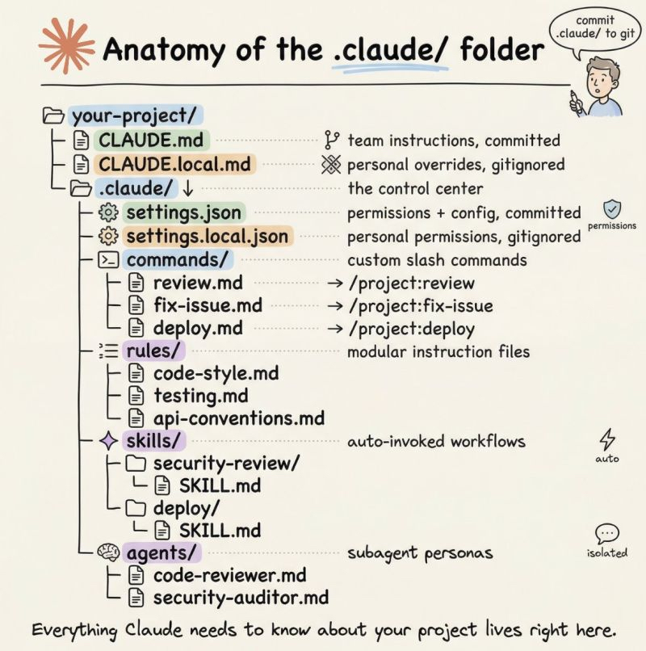

# AI-for-data-science
Creating a space to chat, share, and create AI for environmental data science. We primarily use R and follow open-science and reproducible tools and workflows.

## Next steps
- set up `.claude/` folder in this repo to hold R data science relevant configurations and resources

## Resources

Sharing resouces for AI in datascience

### Basics / General
- [IBM prompt engineering handbook](https://www.ibm.com/think/prompt-engineering#605511093)
- [UC Davis Data Lab open-source LLM setup](https://ucdavisdatalab.github.io/workshop_llm_with_ollama/chapters/index.html)
- [ESIP Data Readiness Cluster - Context Engineering for Environmental Data Systems](https://www.youtube.com/watch?v=IYkZCcEwXpQ)
- [Turn GitHub Repo into text for LLM](https://blog.stephenturner.us/p/github-repo-to-text-for-llm-input)
- [Stanford CS224N: Natural Language Processing with Deep Learning | Winter 2021](https://www.youtube.com/playlist?list=PLoROMvodv4rMFqRtEuo6SGjY4XbRIVRd4) (if you want to learn more about the innerworkings of LLMs)
- [Creating context structure for your projects](https://github.com/andrefigueira/.context/)

### Agents

### Skills
- [GitHub repo - Claude Code configurations for R development](https://github.com/ab604/claude-code-r-skills)
- [Claude skills for R](https://www.r-bloggers.com/2026/03/a-few-claude-skills-for-r-users/)

### Different models

#### Claude
- [Claude Code (CLI) documentation](https://code.claude.com/docs/en/quickstart)
- [Getting started with Claude code](https://www.dataquest.io/blog/getting-started-with-claude-code-for-data-scientists/)
- [Use of Claude with R example](https://www.simonpcouch.com/blog/2025-07-17-claude-code-2/)
- [Claude code tips](https://github.com/ykdojo/claude-code-tips)
- [Writing a good CLAUDE.md](https://www.humanlayer.dev/blog/writing-a-good-claude-md)

#### Positron
- [Positron CLI documentation](https://positron.posit.co/)
- [Positron assistant chat instructions](https://positron.posit.co/assistant-chat-instructions.html)

## Challenges we have observed and looking to fix
- implementing coding style guides and formatting 
- repetative context setting in Positron Assistant chat
- general model doesn't have the skills for nuanced data science tasks
- 
